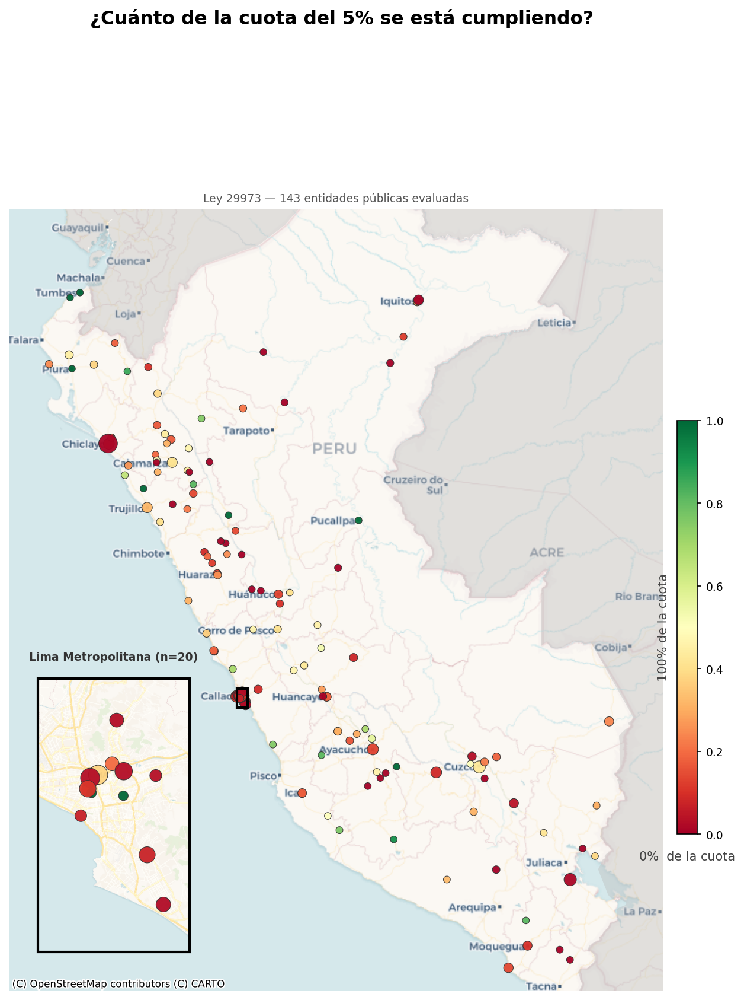
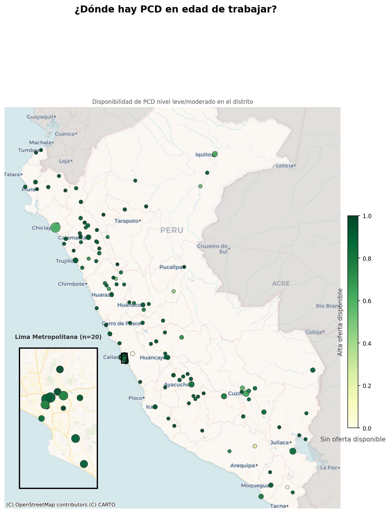
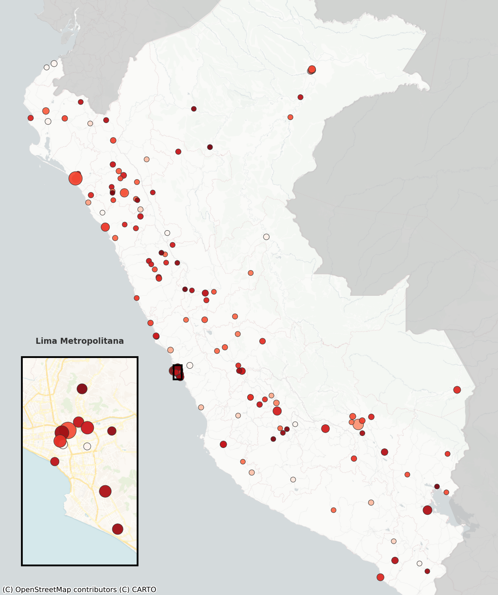

# Disability Employment Quota — Geospatial Analysis (Peru 2023–2024)

Cross-analysis of public-sector compliance with Peru's 5% disability employment
quota (Law 29973) against the territorial distribution of working-age people
with disabilities. Produces three composite indices — coverage, viability, and
intervention priority — mapped at the institutional level across all Peruvian
districts.

> Data sources: **DFS** (Employment Quota Registry, Jan–Dec 2023) and
> **DPRIPD** (PCD Registry by age group and severity, Sep 2024) — both
> published by [GeoPeru / CONADIS](https://www.geoperu.gob.pe/).

---

## Context

Peru's Law 29973 requires public institutions with 20 or more employees to
reserve at least 5% of their workforce for persons with disabilities (PCD).
Despite this mandate, enforcement data is fragmented across four registries and
has never been systematically cross-referenced with the actual supply of
employable PCD at the district level.

This project integrates both sides of the equation — institutional demand and
territorial supply — to produce an actionable, georeferenced picture of where
the gap is largest and where it is most feasible to close.

---

## Objectives

- Quantify the compliance gap between the legal quota and actual PCD
  employment in each public institution.
- Estimate the pool of working-age PCD (mild/moderate disability) available
  within each district.
- Derive three composite indices: **coverage**, **viability**, and
  **intervention priority**.
- Produce publication-quality choropleth maps at the national level with a
  Lima Metropolitan inset.
- Publish results as an interactive dashboard via GitHub Pages.

---

## Dataset

| Property | Detail |
|---|---|
| **Source** | GeoPeru / CONADIS open data portal |
| **DFS period** | January – December 2023 |
| **DPRIPD period** | September 2024 |
| **Geographic level** | District (distrito), province, and department |
| **Institutions covered** | Regional governments, provincial municipalities, district municipalities, and other public entities |
| **Key variables** | `TOT_TRAB`, `TOT_PCD`, `FALT_PCD`, `PCD_PEA`, severity levels L0–L3, UBIGEO codes, coordinates |
| **Format** | `.dbf` inside `.zip` archives (downloaded directly from remote URLs) |

---

## Methodology

1. **Data acquisition** — Remote download of 9 ZIP archives from GeoPeru;
   extraction of `.dbf` files in memory with automatic latin-1 → UTF-8
   encoding correction.
2. **Cleaning & validation** — Column selection, type casting to nullable
   `Int64`, clipping of out-of-range ratios.
3. **Transformation** — PEA proxy computed from age cohorts 18–59; severity
   levels merged by UBIGEO; working-age employable PCD (`PCD_PEA_L1L2`)
   weighted by mild/moderate share.
4. **Index construction**
   - `IDX_COBERTURA` = min(actual PCD / quota, 1)
   - `IDX_VIABILIDAD` = 1 − min(deficit / district supply, 1)
   - `IDX_PRIORIDAD` = (1 − coverage) × viability
5. **Spatial analysis** — Four DFS tables unified; institutions projected to
   Web Mercator (EPSG:3857); point-layer built with `GeoPandas`; country
   mask derived from Natural Earth shapefiles.
6. **Visualisation** — Three choropleth maps (one per index) with
   proportional markers scaled by `FALT_PCD` and a Lima Metropolitan inset;
   exported as transparent PNG at 150 dpi.
7. **Publication** — Dashboard deployed on GitHub Pages from `index.html`.

---

## Repository Structure

```
geoinclusion/
├── data/                   # Raw .dbf files (not tracked — see .gitignore)
├── docs/                   # Reports
│   └── Propuesta_de_Solucion.pdf
├── img/                    # Generated maps and charts (tracked)
│   ├── mapa_IDX_COBERTURA.png
│   ├── mapa_IDX_VIABILIDAD.png
│   └── mapa_IDX_PRIORIDAD.png
├── notebooks/              # Main analysis notebook
│   └── notebooks/analisis_cuota_empleo_pcd_geoperu.ipynb   
├── .gitignore
├── index.html              # Interactive dashboard (GitHub Pages)
├── README.md
└── requirements.txt
```

---

## Key Analyses

### Coverage index (`IDX_COBERTURA`)
Measures how close each institution is to meeting the 5% quota. A value of
`1.0` means the quota is fully met; values below `0.5` indicate that fewer
than half the required PCD positions are filled.

### Viability index (`IDX_VIABILIDAD`)
Estimates whether the district where the institution is located has enough
working-age PCD (mild or moderate disability) to absorb its unfilled
positions. High viability means the labour supply exists locally.

### Priority index (`IDX_PRIORIDAD`)
Composite score that ranks institutions by intervention urgency: highest
priority is assigned to those with the largest quota gap **and** the highest
local labour supply — i.e., where non-compliance cannot be attributed to
scarcity of candidates.

---

## Visualisations

| Coverage of the 5% quota | District-level PCD labour supply | Intervention priority |
|:---:|:---:|:---:|
|  |  |  |

*Marker size is proportional to the number of PCD positions still unfilled
(`FALT_PCD`). Inset shows Lima Metropolitan area at higher zoom.*

---

## Interactive Dashboard

An interactive version of the results is published via GitHub Pages:

**[View the Geoinclusion Dashboard](https://cocobnl.github.io/geoinclusion/)**

---

## Key Findings

- A significant share of evaluated public institutions fall below 50% of the
  required quota, with the largest absolute deficits concentrated in
  large provincial municipalities and regional governments.
- Several districts combine high non-compliance with a substantial pool of
  working-age PCD at mild/moderate severity — indicating that the gap is
  structurally addressable.
- Lima Metropolitan concentrates the highest number of high-priority
  institutions, though non-compliance is spread across all regions.

---

## Limitations

- **Temporal mismatch**: the DFS employment data covers 2023 while the DPRIPD
  disability registry corresponds to September 2024; the cross-sectional
  comparison is approximate.
- **PEA proxy**: working-age PCD is estimated from age cohorts rather than
  observed labour-force participation rates.
- **Geocoding coverage**: institutions lacking valid coordinates are excluded
  from maps but are included in tabular analysis.
- **Severity weighting**: only mild (L1) and moderate (L2) cases are counted
  as "employable", which may underestimate true supply.
- **Registry completeness**: self-reported figures in the DFS may
  underreport actual PCD employment.

---

## Next Steps

- Incorporate the 2024 DFS update when published by CONADIS.
- Add formal labour-force participation rates by disability type (INEI
  ENEDIS survey) to refine the viability index.
- Build a district-level ranking table exportable to CSV/Excel for
  operational use by enforcement agencies.
- Migrate visualisations to an interactive web map (Folium or Plotly) for
  finer exploration.
- Automate the pipeline with a scheduled script to refresh data on each
  GeoPeru release.

---

## Proposals and Policy Recommendations

Analytical proposals and policy recommendations derived from this work are
presented in a separate document:

**[Read the full Proposals and Policy Recommendations Report (PDF)](docs/Propuesta_de_Solucion.pdf)**

---

## Reproducibility

```bash
# 1. Clone the repository
git clone https://github.com/<your-username>/disability-employment-quota-peru.git
cd disability-employment-quota-peru

# 2. Create and activate a virtual environment (recommended)
python -m venv .venv
source .venv/bin/activate        # Windows: .venv\Scripts\activate

# 3. Install dependencies
pip install -r requirements.txt

# 4. Launch Jupyter and run the notebook
jupyter notebook notebooks/geoton_2026_clean.ipynb
```

> **Note:** the notebook downloads all data directly from GeoPeru's public
> URLs — no manual data download required. A stable internet connection and
> ~200 MB of free memory are sufficient.

---

## Technologies

| Library | Role |
|---|---|
| `pandas` 2.x | Data wrangling and tabular transformations |
| `numpy` 1.x | Vectorised arithmetic and ceiling/clip operations |
| `geopandas` 0.14+ | Geospatial data structures and CRS reprojection |
| `shapely` 2.x | Polygon operations (union, intersection, difference) |
| `matplotlib` 3.x | Static choropleth map rendering |
| `contextily` 1.x | Web basemap tiles (CartoDB Positron / Voyager) |
| `requests` 2.x | Remote ZIP download |
| `dbfread` 2.x | Parsing of `.dbf` binary files |
| `jupyter` / `nbformat` | Interactive notebook environment |

---

## Authors

**Coco Benel**
Computational Physicist · Data Analyst · Data Scientist

[](https://linkedin.com/in/coco-bnl)
[](https://github.com/cocobnl)

**Junior Alegre**
Computational Physicist · Data Analyst · Data Scientist

[](https://linkedin.com/in/jalegres)
[](https://github.com/jalegres)

---

*Data published by CONADIS / GeoPeru under open government data licence.
This repository is an independent analytical work and does not represent the
official position of any government agency.*
